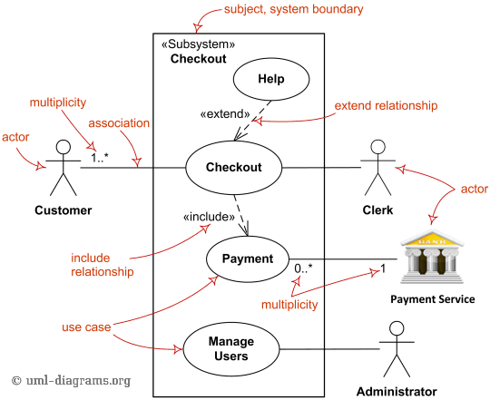
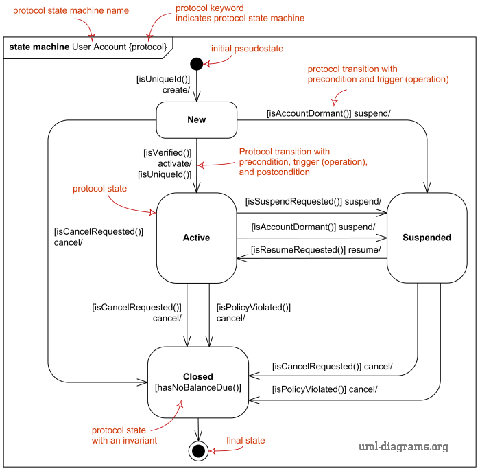
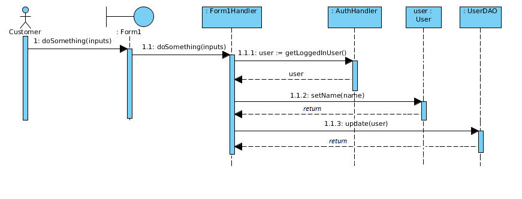
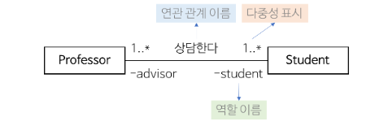
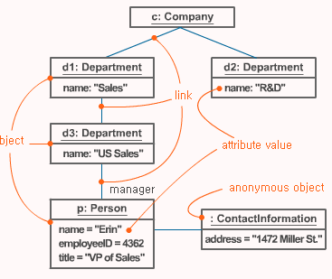

### 1. 현행시스템 분석
##### {1-1} 현행 시스템: 소프트웨어뿐만 아니라 하드웨어, 네트워크 등 관련 인프라를 확인하고 어떤 기술 요소를 적용할 것인지 판단하기위한 **사전 지식 습득** 과정이다.
   + 현행 시스템 파악 절차
    > 구성/기능/인터페이스 파악 -> 아키텍처 및 SW 구성 파악 -> HW 및 네트워크 구성 파악
        
        -현행 시스템 구성 현황 : 기간업무, 지원 업무 구분(기간업무-주요 업무 처리 시스템, 지원 업무-기간 업무 지원 시스템)
        -기능 현황: 단위 업무 시스템이 현재 제공하는 기능 기술
        -인터페이스 현황: 데이터 종류, 데이터 형식, 프로토콜, 연계 유형, 주기 등 명시[xml-json(data 종류), 통신규약(TCP/IP)]
--------------------------------------------------------------------------------------------------------------------------------------------------------------------

##### {1-2} 요구사항 정의
   + 요구공학: 시스템의 개발, **변경의 목적(WHAT)** 을 식별하기 위해 이해관계자들의 요구를 이해 및 조정하여 체계적으로 수집,분석,명세화, 확인하는 공정 또는 이에 관한 학문이다
   + 요구사항 개발 프로세스: [IEEE - SWEBOK] &nbsp;&nbsp; **도출-> 분석 -> 명세 -> 확인** 
        + (요구사항 도출) - 문제 이해, 정보 수집, 이해관계자 식별을 통해 개발자와 고객 사이 관계 형성, 효율적인 의사소통 중요
         
         - 도출의 필요성 : 범위 기준선 제공, 일정-원가 영향, 추적성 제공
         - 도출 기법 -> 핵심 그룹 [이해 관계자 중 Project Sponsor, Owner 구분 | 해당 주제 전문가 집단]
                    -> 심층워크숍 [1박 이상의 워크숍을 통한 심층적인 분석, 장시간, 내부 심리 등 파악 | 여러 부서, 다양한 이해 관계자]
                    -> 인터뷰 [1:1, 1:N , 고전적임 but 효율성 좋음(많이 이용) | 구조적, 비 구조적]
                    -> 집단창의력기법 [토론, 형식X | 델파이 기법, 브레인스토밍, 마인드맵, 명목그룹기법]
                    -> 설문지, 설문조사 [정보 수집, 정보의 일관성 보장 어렵 ]
                    -> 사용자업무관찰기법 [실 사용자의 환경과 주요 기능 사용 등 가까운곳에서 요구사항 도출 | 캡코더, 사용자가 인지못한 요구사항 도출]
                    -> 프로토타입 [시제품 -> 정보수집, 효율성 극대화]
                    -> 집단의사결정기법 [토론, 환경-상황-시나리오 등을 통한 의사결정 | 독재,다수결, 과반수, 만장일치, 우선순위평가]
          
         - 요구사항 분류에 따른 도출 -> 기능적 : 기능(시스템 수정), 자료, 인터페이스, 사용자(인터뷰, 관찰 등 활용)
                                   -> 비기능적 : 자원(시스템 제약사항, HW특징, 필요 및 가용자원), 성능(속도,처리율, 자료크기), 보안, 품질(신뢰성,가용성,유지보수성,보안 품질)
        + (요구사항 분석) - 요구사항 간 상충 해결, SW 범위 파악, 환경과의 상화 작용, 시스템 요구사항 정제하여 SW 요구사항 도출
        
              - 분석의 필요성: Snowball Effect 현상(요구 분석 불명확 -> 시간이 지날수록 비용 증가) 방지, Glod plate 방지 => 프로젝트 범위 명확화
              - 분석 기법 -> 요구사항 분류 [기능-비기능, 범위, SDLC 등 여러가지 기준으로 분류]
                         -> 개념 모델링 [실세계 문제 모델링]
                         -> 요구사항 할당 [아키텍처 구성 요소 식별, 다른 요소와의 상호작용 -> 추가적인 요구사항 발견]
                         -> 요구사항 협상 [이해관계자들의 상충, 요구사항-리소스, 기능-비기능 서로 상충]
                         -> 정형 분석 [시멘틱 언어(형식적)로 요구사항 표현, 정확-명확 -> 오해 소지 최소화, "요구사항 분석 마지막 단계에서 수행"]
         
             -  UML(Unified Modeling Language): SW 집약 시스템의 시각적 모델을 만들기 위해 도안 표기법을 사용하고, 객체 관리를 위해 표준화된 범용 모델링 언어이다
                    
                    - UML 특징
                        => 가시화 언어 : [개념모델 작성, 오류 없이 전달, 의사소통 용이, 그래픽 언어]
                        => 명세화 언어 : [정확한 모델 제시, 완전한 모델 작성, 분석-설계의 결정 표현]
                        => 구축 언어 : [다양한 Prog.언어와 연결, 왕복 공학 기능, 실행 시스템 예측 가능] 
                        => 문서화 언어 : [시스템 통제, 평가, 의사소통의 문서]
                        
                    - UML 4+1 View Model : 사실상의 표준(De-fecto 표준 = 공식적으로 표준화 X, 업계나 시장에서 사실상 표준으로 받아들이고 사용)
                        
                                Use-Case View        |         Logical View        |            Implementation View             |           Process View          | Deployment View
                        -----------------------------| ----------------------------|--------------------------------------------|---------------------------------|----------------------------------------------------
                        사용자 관점, 시스템 기능 명세  | 설계자 관점, 전체 레이어 구성 | 개발자 관점, 컴포넌트와 이들 간의 상호관계 정의| 시스템 통합 관점, 비기능적 요구사항| 시스템 엔지니어 관점, 물리적 노드 프로세스 분석 및 배치
                        Use-case다이어그램, User Story| Class, Sequence 다이어그램  |           Package 다이어그램                 |        Activity 다이어그램       |  Deployment 다이어그램 
                        
          - SRS : 요구분석 단계의 요구사항+스팩을 정리한 산출물, SW 요구사항명세문서
               
               + SRS 상세화 정도 -> 낮음 [요구 분석, 설계, 구현 인력 동일, 유사 경험 많음]
                 &nbsp;&nbsp;&nbsp;&nbsp;&nbsp;&nbsp;&nbsp;&nbsp;&nbsp;&nbsp;&nbsp;&nbsp;&nbsp;&nbsp;&nbsp;&nbsp;&nbsp;&nbsp;&nbsp;&nbsp;&nbsp;&nbsp;&nbsp;&nbsp;&nbsp;&nbsp;&nbsp;&nbsp;
                -> 보통 [요구 분석, 설계, 구현 인력 다름, 유사 경험 없음]
                 &nbsp;&nbsp;&nbsp;&nbsp;&nbsp;&nbsp;&nbsp;&nbsp;&nbsp;&nbsp;&nbsp;&nbsp;&nbsp;&nbsp;&nbsp;&nbsp;&nbsp;&nbsp;&nbsp;&nbsp;&nbsp;&nbsp;&nbsp;&nbsp;&nbsp;&nbsp;&nbsp;&nbsp;
                -> 높음 [일부 단계 외주 운영, Critical SW 개발, 구성원 원거리 근무]
                
       + (요구사항 명세) - 기능 요구사항 및 품질 특성(비기능적 요구사항)을 작성하는 단계
       
                - 요구사항 명세서의 평가 기준
                    -> 정확성, 명확성(각 명세 내용 하나의 의미 포함), 완전성, 일관성, 중요성(우선 순위 부여),
                     검토 기능(요구사항 충족, 달성 정도 파악), 수정 기능, 추적 기능(상호 참조 기능)
                - 요구사항 명세서 작성 시 유의 사항
                    -> 이해성, 상호성, 기능 정의, 제약 조건, 테스트 기준, 품질 측정
                    
       + (요구사항 확인(검증)) - 요구사항의 명확화(일관성, 완전성)+분할 발주를 통한 개발 단계에서 요구 변경 최소화 & 감리 시행 -> 품질 보장
       
               - 요구사항 확인 기법 
                 -> 요구사항 검토: 시스템 정의서, 시스템 사양서, SW요구사항 명세서를 완성 시점에서 진행
                 -> 프로토타이핑: 사전에 모의 형식의 테스트베드 타입으로 구성
                 -> 모델 검증: 분석 단계에서 개발딘 모델의 품질 검증
                 -> 인수 테스트: 최종 제품이 요구사항 만족하는지 확인
            
   + 요구사항 보장을 위한 방안
        - 상세 요구 사항(RFP) -> 요구 분석 -> 분할 발주 -> 보증 활동 -> 감리 시행 -> 요구사항 보장(RFP)
        - 발주 단계별 요구사항 상세화: 
         사업 추진(조직 구성, 추진 체계 수립) ->  
         사업 범위 및 방향성 수립(사업 개념+이해관계자 정의, 추진범위/방향성 수립) -> 
         업무 및 기술 현황 분석 단계(내/외부 환경, 시사점/개선사항 도출, 범위방황성 검토 보완) -> 
         제안요청서 요구사항 정의 단계(이해관계자 요구사항 수립, 요구사항 분석 및 도출, 요구사항 상세내역 작성 및 검토) -> 
         사업계획 수립 및 발주 단계(발주 계획, 제안 작성 및 법제도 요건, 입찰 공고, 평가 선정)->  
         사업이행 및 관리단계(사업수행계획서 검토 승인, 요구관리체계 수립)
         
       - 분할 발주를 통한 요구상세 검증
            - 설계 사업: 요건 정의, 요구 분석, 기본설계
            - 구현 사업: 상세 설계, 개발, 테스트 
       - 품질보증활동에서 요구 검증
            - 프로세스: 품질보증계획, 엔지니어링 활동 검토, 품질 측정평가, 문서화, 승인, 보고통보
            - 품질활동: 형상관리, 문서관리, 품질기록, 합동 검토, 우험관리
            
   + 요구사항의 기술적 타당섬 검토: 적용 기술 적합성 + 기술실현의 가능성   
        => 분석  
            **[성능 및 용량산정 적정성 (비기능) -> 시스템간 상호운용성(시스템 간 정보 및 서비스 교환) -> IT시장 성숙도 및 트렌드 부합성 (유지보수)-> 기술적 위험 분석(복잡성, 검증 여부, 의존성 -> 위험 발생 가능성)]**
----------------------------------

##### {1-3} 분석모델 확인하기
 * 분석 모델 검증
     - 분석 모델 검증 순서: usecase모델 검증(actor, usecase) -> 개념 수준 분석 클래스 검증(class[class명+attribute], relationship) -> 분석 클래스 검증(stereotype[control, boundary, entity], relationship+상세화)

     - usecase모델 검증 

            | actor | usecase | usecase명세서 | 
     
* 다이어그램 종류 상세 내용
     - Class 다이어그램: class + class간의 관계 [**정적 모델링**]
          | class name |
          | ----- |
          |- id: String - name:Stirng - number: Integer|
          |+ addStudent(student:Student): void - deleteStudent(id:Integer): void # testStudent(): void ~ test2Student(): void|

               public   | + | 어떤 class의 객체에서든 접근 가능
               private  | - | 이 class에서 생성된 객체들만 접근 가능
               protected| # | 이 클래스와 동일 package에 있거나 상속 관계에 있는 하위 class의 객체들만 접근 가능
               package  | ~ | 동일 package에 있는 클래스의 객체들만 접근 가능

     * 관계

               # --은 점선, ==은 실선

               - association: class A가 classB를 멤버 변수로 가지고 있고, 사용한다 
                    [class A ==> classB]

               - generalization: IS-A관계, classA(부모)-classB(자식)
                    [classA ◁== classB]
               
               - 집합(aggregation-집약): classA가 classB를 멤버 변수로 가지고 있지만 classA가 직접 new를 하지 않는다, classA가 전체 개념-classB가 부분 개념
                    [classA ◇== classB]
               
               - 집합(composition-합성): classA가 classB를 멤버 변수로 가지고 있지만 classA가 직접 new해서 생성한다 --> 전체가 사라지면 부분도 사라짐
                    [classA ◆== classB]

               - dependency: classA의 함수가 classB의 함수를 호출하거나 classB를 함수의 인자로 받는 등 사용하는 경우, 멤버변수로 갖는것이 아닌 지역 변수 or 파라미터로 사용
                    [classA --> classB] 

               - realization: interfaceA가 있고 classB가 interfaceA를 구현
                    [classA ◁-- classB]

     * Interaction 다이어그램: sequence + activity 다이어그램 [**상호 프로그램 간 동작 과정**]
          
     
     * Communication 다이어그램: 객체들간의 상호 작용을 연결에 초점을 맞춰 기술, 보다 명확한 객체들의 상호작용 도식화, sequnce다이어그램+관계 [**객체 간 상호작용 + 관계**] **동적 모델링**
          

     * Timing 다이어그램: 객체들간 상호작용 + 시간제약

     * UseCase: 사용자+시스템(사용자 view단)  [**기능 모델**]
          
          왼쪽 actor: system을 사용하는 actor 
          오른쪽 actor: 서비스를 제공하는 외부 system 
          - usecase: system의 기능 단위 => 동사+목적어 [주어는 system]
          - relationship: incude, extend, generalization
                    
                    1. incude: 여러 usecase가 필요한 공통적인 기능으로 반드시 실행된다.
                    A -(include)-> 
                                   B  ==> A와C를 하려면 무조건 B가 수행되야함 
                    C -(include)->

                    2. extend: 기존 usecase에서 진행 단계를 추가하여 새로운 usecase를 만들어내는 관계 => 즉, 기준 usecase조건이 만족해야만 실행된다.
                    도서예약 <-(extend)- 예약 가능 확인

                    3. generalization: 고객이 회원/비회원이라 치면 고객액터와 회원/비회원액터는 일반화 관계  

     * State machine 다이어그램: 객체의 상태에 따른 작업+event [**객체 중심**] **동적 모델링**
            
                    
                    - ●(시작노드) / ⊙(종료노드) 
                    - 전이 조건: []를 사용하여 조건 명시(어떤 조건에 따라 상태 전이)
                    - 메시지: 한 객체가 다른 객체에게 상태전이를 일으키는 촉발 메시지
                    - 신호: 메시지를 받는 객체의 상태 다이어그램에서 전이를 촉발시키는 메시지
          | state name |
          |:-----:|
          |상태 변수|
          |활동: entry, exit, do|
     * sequence 다이어그램: 객체들의 상호작용 순서에 초점을 맞춰 기술, 프로세스 과정을 보여줌 --> class간의 오퍼레이션을 통한 상호작용 위주
      **동적 모델링**
          
          [참고사이트](https://sabarada.tistory.com/84)
     
     * deployment 다이어그램: 시스템의 물리적인 구조, 서버/클라이언트 간 관계, 시스템의 환경 설정
          

               - 노드: SW를 실행할 수 있는 무언가(장치(HW) or 실행환경(OS or 컨테이너))
               - artifact: 실행 파일(exe, DLL, JAR), 환경 설정 파일, HTML 문서 등, 노드에 포함된다
               <<artifact>>
     
     * package 다이어그램: 시스템의 컴파일 시 계층적인 구조
     * activity 다이어그램: 조건에 따른 흐름(절차적)과 병행(병렬) 처리의 표현, 프로그램의 수행 과정을 보여줌 [**기능 모델**] 
     **swim-lane : 각 역할에 따른 활동**
          

               - action은 원자성, activity는 몇개의 action으로 분리 가능

               - 결정 노드(분기 노드) + 병합 노드: 빈 마름모 => 어떠한 선택의 기로가 있을때 , 둘중 어느것을 선택할 것인가
                    (ex) 집안일 시작 - 설거지 vs 방 청소 (동시에 둘다 불가)

               - 포크노드 + 조인 노드: 굵은 선 => 두가지 업무를 동시에 진행 
                    (ex) 방청소 + 노래듣기
     * component 다이어그램: 시스템을 구성하는 소프트웨어의 조각, 임베디드 컨트롤러 등 표시,  컴포넌트-인터페이스-의존관계로 표현

          [**CBO등 객체지향 개발 방법론에서 가장 많이 사용**]
          
     
     * object 다이어그램: 특정 시점의 개체의 snapshot기술
          
               # 0..1 : 0또는1 / 1,2,6: 1 또는 2 또는 6/ 1..*: 1 또는 그이상/ * : 0 또는 그 이상
           
          
          **object는 class이름에서 class이름:object이름 으로 표기**
     
     * composite 다이어그램: 하나의 클래스 실행 시 내부 구조 기술(class 상세구조)
          

----------------------------------

##### {1-4} 논리 데이터 모델 설계
     

                       